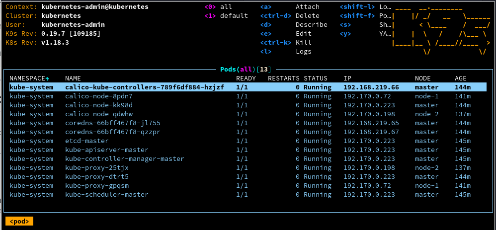
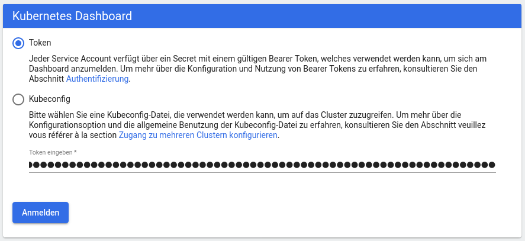
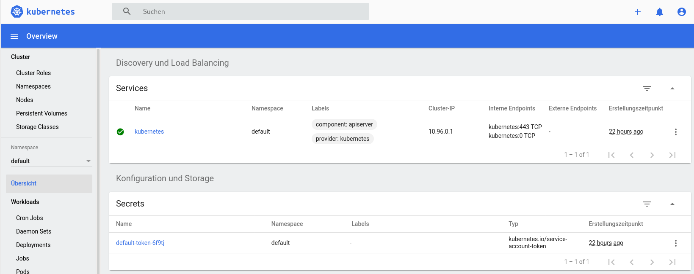
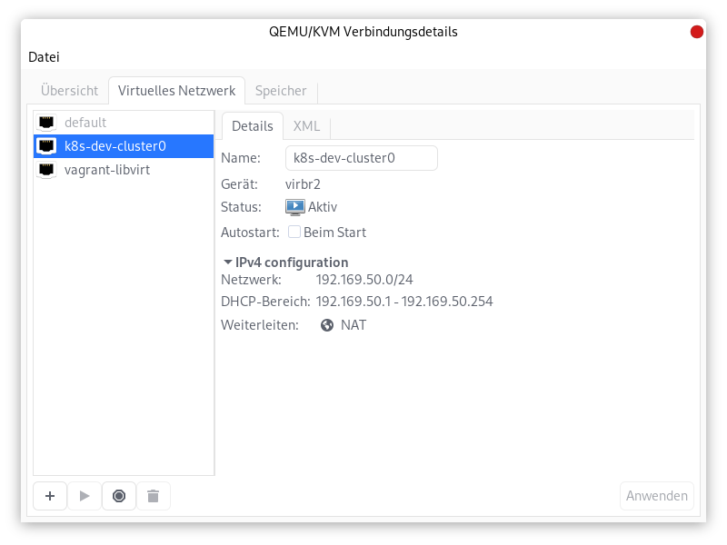

# Local kubernetes development cluster

## Why?

> "Every public cloud provider has kubernetes clusters in their offerings. So why should I need a local cluster?"

Yes, you are right. But normally you have to pay for it (at least after the free trial period has ended).  

> "Hmm, but just in case I need a local kubernetes there are projects like [Minikube](https://kubernetes.io/de/docs/setup/minikube/), [KinD (Kubernetes in Docker)](https://kind.sigs.k8s.io/) or [Minishift](https://www.okd.io/minishift/)." 

Yes and these are great projects to get you started with learning and using kubernetes. They come with a ready to use kubernetes installation and your're all set to go.  

For me it was important to learn how to do a basic installation of kubernetes in a somewhat more realistic setup. The aforementioned projects for local kubernetes only include an all in one single node installation. But I wanted to have multi node cluster and with the ressources of todays laptops this should not be a problem. 

This project targets my own needs. I work with [Fedora Linux](https://getfedora.org) on my laptop and so the playbooks are only tested on Fedora 32. If you have the same needs of learning something about a local kubernetes cluster installation on Fedora 32 chances are that you will learn something, too.

## What?

We will do an automatic and repeatable installation of a local multi node kubernetes cluster. 
We will use 

**Host Operating System (on your laptop)**

* [Fedora 32 as host operating system](https://getfedora.org)

**Virtualization**

* [KVM as virtualization solution for the necessary virtual machines](https://www.linux-kvm.org)
* [libvirt as virtualization API](https://libvirt.org/)
* [Virt Manager UI](https://virt-manager.org/) or [virsh](https://libvirt.org/manpages/virsh.html) to access the virtualization API

**Automatic infrastructure setup**

* [Vagrant to automate the VM setup](https://www.vagrantup.com/)
* [Vagrant libvirt plugin](https://github.com/vagrant-libvirt/vagrant-libvirt)
* [Ansible to automate the kubernetes installation](https://www.ansible.com/)

**Kubernetes cluster**

* [Ubuntu 18.04 as os for the kubernetes nodes](https://app.vagrantup.com/generic/boxes/ubuntu1804)
* [Docker as container engine for kubernetes](https://www.docker.com/)
* [kubeadm to simplify the kubernetes installation](https://kubernetes.io/docs/setup/production-environment/tools/kubeadm/install-kubeadm/)
* [Calico as CNI plugin for the pod network](https://www.projectcalico.org/)

**Kubernetes cli tools**

* [kubectl to access the kubernetes cluster](https://kubernetes.io/docs/reference/kubectl/overview/)
* [k9s for a simplified access to the cluster](https://github.com/derailed/k9s)

## How?

### Clone this repo

To get a quick start you should clone this repo. 

```shell
[peter@alastor k8s-dev-cluster]$ tree
.
├── LICENSE
├── master-playbook.yml
├── node-playbook.yml
├── README.md
└── Vagrantfile
```

### Install the prerequisites on your laptop

```shell
sudo dnf install qemu-kvm qemu-img virt-manager libvirt python3-libvirt libvirt-client virt-install virt-viewer bridge-utils gcc git make vagrant vagrant-libvirt vagrant-sshfs ansible

```

### Change the number of worker nodes

By default you will get a local cluster with one master and two worker nodes. 
You can change the number of worker nodes by changing the value of the variable `N` in Vagrantfile.

```vagrant
...
N = 2
...
```

### Adjust the synced folder settings

To share files between your local machine and the vagrant boxes (master and worker nodes) 
you need to create local folder for each of your boxes. 

If you set the number of worker nodes to `N = 2` you have to create two local folders. 
The folder needs to be named like name of the corresponding node it is mounted on. 

In my setup I share these folders:

```shell
[peter@munin vagrant-volumes]$ tree
.
├── node-1
├── node-2
├── node-3
└── node-4

4 directories, 0 files
```

In the `Vagrantfile` you can change the local folder names and the remote folder names:

```yaml
...
           node.vm.synced_folder "/home/vagrant-volumes/node-#{i}", "/mnt/k8s-volume", type: "9p"
...
```

The synced folders are necessary to provide your kubernetes installation with a persistent volume per node on local storage. 

Because I had some trouble to get the permission settings right on the synced folders I gave up on fiddling it out and just switch the user, group and  dynamic_ownership in `/etc/libvirt/qemu.conf`. 

```shell
...
user = "root"
group = "root"
dynamic_ownership = 0
...
```

In addition I had to disable the SELinux enforcement because of this error:

```shell
There was an error talking to Libvirt. The error message is shown
below:

Call to virDomainCreateWithFlags failed: Interner Fehler: qemu unexpectedly closed the monitor: 2020-05-28T16:57:10.911513Z qemu-system-x86_64: warning: host doesn't support requested feature: MSR(48FH).vmx-exit-load-perf-global-ctrl [bit 12]
2020-05-28T16:57:10.911637Z qemu-system-x86_64: warning: host doesn't support requested feature: MSR(490H).vmx-entry-load-perf-global-ctrl [bit 13]
2020-05-28T16:57:10.912857Z qemu-system-x86_64: warning: host doesn't support requested feature: MSR(48FH).vmx-exit-load-perf-global-ctrl [bit 12]
2020-05-28T16:57:10.912875Z qemu-system-x86_64: warning: host doesn't support requested feature: MSR(490H).vmx-entry-load-perf-global-ctrl [bit 13]
2020-05-28T16:57:10.932069Z qemu-system-x86_64: -device virtio-9p-pci,id=fs0,fsdev=fsdev-fs0,mount_tag=49682b31e655534e6f86d145d37f38c,bus=pci.0,addr=0x5: cannot initialize fsdev 'fsdev-fs0': failed to open '/home/vagrant-volumes/node-1': Permission denied

```

```shell
$ sudo setenforce 0
```

### Start the installation

After that make sure your current directory is the directory of `Vagrantfile`. 

Then just type at your commandline 

```shell
VAGRANT_DEFAULT_PROVIDER=libvirt vagrant up --no-parallel
```

Now vagrant will bring up the master vm and will install kubernetes on it. The kubernetes installation is delegated to ansible via this `master-playbook.yml`.

When the installation of the master has finished your directory looks like that

```shell
[peter@alastor k8s-dev-cluster]$ tree
.
├── join
├── kubeconfig
│   └── master
│       └── home
│           └── vagrant
│               └── .kube
│                   └── config
├── LICENSE
├── master-playbook.yml
├── node-playbook.yml
├── README.md
└── Vagrantfile
```

The file `join` contains the command for the worker nodes to join the new cluster.

```shell
[peter@alastor k8s-dev-cluster]$ cat join 
kubeadm join 192.169.50.10:6443 --token j73q4h.7y7kkxnnwxxxxxxx     --discovery-token-ca-cert-hash sha256:ea91bb578b355dbf570c9f375df999fb7ae46c59f96eb206760d17xxxxxxxxxx
```

The file `config` contains all the information for kubectl to access the new cluster. Please copy this file to the `.kube` folder in your home directory. 

```shell
cp kubeconfig/master/home/vagrant/.kube/config ~/.kube/
```

After the master the installation of the worker nodes will be started. When the installation has finished you can access the cluster. 

### Using local storage

In case you want to deploy some apps which need persistent storage than you should also deploy a persistent volume on local storage. 

The file `local-storage.yml` contains a default storage class for local storage and it also defines two persistent volumes for the nodes `node-1` and `node-2`.

Of course you can add more persistent volumes according to your needs. 

You need to adjust the local directory in `local-storage.yml`:

```yaml
...
  storageClassName: local-storage
  local:
    path: <INSERT THE PATH OF YOUR LOCAL STORAGE DIRECTORY HERE>
  nodeAffinity:
...
```

Just apply the `local-storage.yml` via 

```shell
kubectl apply -f local-storage.yml
```

### Test the cluster

Make sure you have copied the kube config file as describe above. 

```
[peter@alastor k8s-dev-cluster]$ kubectl get cs
NAME                 STATUS    MESSAGE             ERROR
scheduler            Healthy   ok                  
controller-manager   Healthy   ok                  
etcd-0               Healthy   {"health":"true"}
```

You can also start k9s to the see the the status of all resources inside the cluster.



## What next?

### Kubernetes Dashboard

Kubernetes comes without a UI. The only way to access the cluster is via its API and cli tools like `kubectl` or `k9s`. 

If you want a simple web based UI you should have a look at the [kubernetes dashboard](https://kubernetes.io/docs/tasks/access-application-cluster/web-ui-dashboard/).

**Installation**

```shell
kubectl apply -f https://raw.githubusercontent.com/kubernetes/dashboard/v2.0.0/aio/deploy/recommended.yaml
```

**Create a service account and a cluster role binding**

```shell
kubectl apply -f kubernetes-dashboard-user.yml
```

**Get the access token**

```shell
kubectl -n kubernetes-dashboard describe secret $(kubectl -n kubernetes-dashboard get secret | grep admin-user | awk '{print $1}')  | awk '/token:/ {print $2}'  > dashboard.token
```

**Access the dashboard**

```shell
kubectl proxy
```

Open [Dashboard in browser](http://localhost:8001/api/v1/namespaces/kubernetes-dashboard/services/https:kubernetes-dashboard:/proxy/). 



Please paste the token from the file `dashboard.token` in the corresponding input field and login. 



### Cloud Foundry for Kubernetes

* [Install cf for k8s on a local kubernetes cluster](./cf-for-k8s.md)

### Delete the installation

It is as easy as 

```shell
vagrant destroy
```

## Troubleshooting

### Calico pods do not get ready

At the beginning I had some problmes getting the calico pods to work properly. The calico pods on the worker nodes could not reach the kubernetes api server via the kube-proxy. 

After some research I found out that vagrant creates 2 networks via libvirt. One private network for the virtual machines (k8s-dev-cluster0 in my case) and one management network (vagrant-libvirt) for libvirt. 



Calico requires that there is no overlap in the ip address ranges for the vm network, the libvirt management network and the internal pod network. 

So I moved 

* the ip addresses for the vms to `192.169.50.0` (k8s-dev-cluster0 network)
* the ip addresses for the management network to `192.170.0.0` (vagrant-libvirt)
* the ip addresses for the pod network to `192.168.0.0` 

After these changes the calico pods started properly.

## Ressources

* https://github.com/projectcalico/calico/issues/3092
* https://graspingtech.com/create-kubernetes-cluster/
* https://kubernetes.io/docs/tasks/debug-application-cluster/debug-service/#is-the-kube-proxy-working
* https://kubernetes.io/docs/setup/production-environment/tools/kubeadm/create-cluster-kubeadm/
* https://computingforgeeks.com/how-to-install-kvm-on-fedora/
* *https://stackoverflow.com/questions/33864652/how-to-change-vagrant-default-network-range