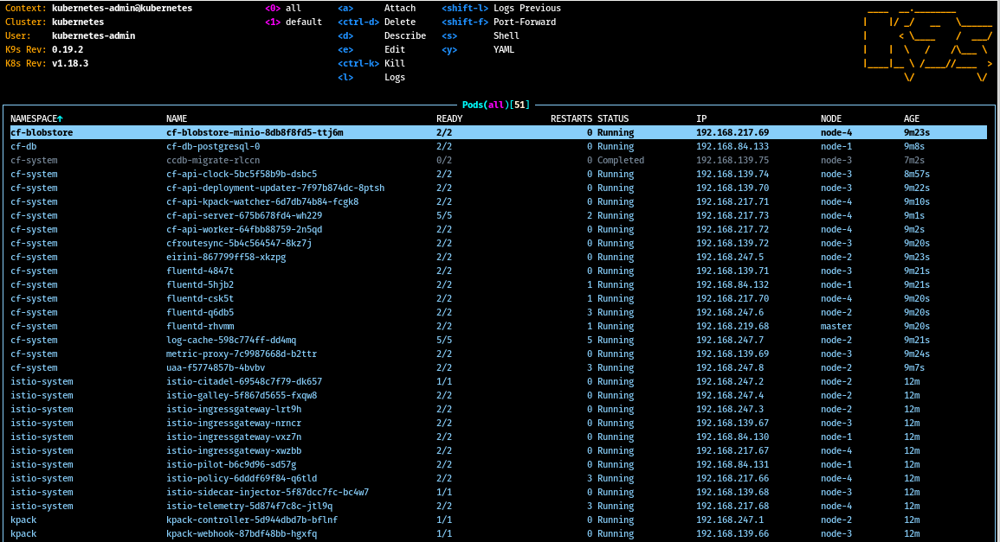

# Using CF for k8s on a local development cluster

## Why?

If you followed my [tutorial on how to set up a local kubernetes cluster](./local-k8s-cluster.md) then you may need a little bit of a workload for your cluster ;-). 

But that was not my use case. I created the aforementioned tutorial because I wanted to install [Cloud Foundry for kubernetes](https://github.com/cloudfoundry/cf-for-k8s)
 locally without having to pay the major public cloud providers just to test this and that.  

## What?

We will install [Cloud Foundry](https://www.cloudfoundry.org/), one of the major open source platforms as a service, on a local kubernetes cluster. 

We will only focus on **cf for k8s** and not [**kubecf**](https://www.cloudfoundry.org/). 

To install CF for k8s on a private local cluster you have to solve some issues which do not exist if you are on e.g. GKE. 

These are

* You have to install a metrics server into the cluster
* You have to provide some persistent volumes to successfully start `minio` and `postgres`
* You have to solve DNS issues via modifications in `/etc/hosts`
* You have to solve the LoadBalancer problem to get access to your cf api
* And you need some coffee for the waiting time

## How?

### Install cf cli

* [cf cli](https://docs.cloudfoundry.org/cf-cli/install-go-cli.html)

```shell
$ sudo wget -O /etc/yum.repos.d/cloudfoundry-cli.repo https://packages.cloudfoundry.org/fedora/cloudfoundry-cli.repo

$ sudo dnf install cf-cli
```

### Install kapp

* [kapp](https://k14s.io/#install)

```shell
$ sudo dnf install -y perl-Digest-SHA
$ wget -O- https://k14s.io/install.sh | sudo bash
```

### Install a metrics-server into your cluster

You can install the metrics-server directly from github via 

```shell
$ kubectl apply -f https://github.com/kubernetes-sigs/metrics-server/releases/download/v0.3.6/components.yaml
```

In my case there were some DNS issues which means that the metrics-server cannot do its work in full beauty because it cannot resolve the node names. 

That is why I added the argument `--kubelet-preferred-address-types=InternalIP`. 
And because of tls certification verification issues I also had to add `--kubelet-insecure-tls`  

You can install the patched version via 

```shell
kubectl apply -f ./metrics-server-v0.3.6.yml
```

### Git clone cf-for-k8s repo

```shell
$ git clone https://github.com/cloudfoundry/cf-for-k8s.git
$ cd cf-for-k8s
```

### Install BOSH cli

* [BOSH cli](https://bosh.io/docs/cli-v2-install/)

```shell
$ curl -L https://github.com/cloudfoundry/bosh-cli/releases/download/v6.2.1/bosh-cli-6.2.1-linux-amd64 --output bosh
$ chmod u+x bosh
$ sudo mv bosh /usr/local/bin/
```

### Start the installation

```shell
$ ./hack/generate-values.sh -d system.local-cf.org > /tmp/cf-values.ym
$ ytt -f config -f /tmp/cf-values.yml > /tmp/cf-for-k8s-rendered.yml
$ kapp deploy -a cf -f /tmp/cf-for-k8s-rendered.yml -y
```

To save some resources on my local laptop I changed every `replicas:` and `maxReplicas:` value to `1` in file `/tmp/cf-for-k8s-rendered.yml`.

On my machine it takes about 12 minutes to start up all pods.



### Hackadihackhack DNS

Open your hosts file in your favourite editor ...

```shell
$ sudo nvim /etc/hosts
```

and hack some DNS entries ...

```shell
192.169.50.14 api.system.local-cf.org
192.169.50.14 system.local-cf.org
192.169.50.14 apps.system.local-cf.org
192.169.50.14 login.system.local-cf.org
192.169.50.14 uaa.system.local-cf.org
192.169.50.14 log-cache.system.local-cf.org                                                                   
192.169.50.14 doppler.system.local-cf.org
192.169.50.14 test-node-app.apps.system.local-cf.org
```

### Validate the installation

```shell
[peter@munin cf-for-k8s]$ cf api --skip-ssl-validation https://api.system.local-cf.org
Festlegen von API-Endpunkt auf https://api.system.local-cf.org...
OK

API-Endpunkt:   https://api.system.local-cf.org
API-Version:    2.150.0
Not logged in. Use 'cf login' or 'cf login --sso' to log in.
```

Please get the `cf_admin_password` from `/tmp/cf-values.yml` to login. 

```shell
[peter@munin k8s-dev-cluster]$ sudo nvim /etc/hosts
[sudo] Passwort für peter: 
[peter@munin k8s-dev-cluster]$ cf auth admin l1stl0jjxbhy479qsr1o
API-Endpunkt: https://api.system.local-cf.org
Authentifizieren...
OK
```

And your are logged in in your own Cloud Foundry installation on your own private local kubernetes cluster on your laptop. 

Congratulations!

### Create an org and a space

```shell
$ cf create-org test-org
$ cf create-space -o test-org test-space
$ cf target -o test-org -s test-space
```

```shell
[peter@munin k8s-dev-cluster]$ cf target -o test-org -s test-space
API-Endpunkt:   https://api.system.local-cf.org
API-Version:    2.150.0
Benutzer:       admin
Organisation:   test-org
Bereich:        test-space
```

### Push the test app

```shell
$ cf push test-node-app -p tests/smoke/assets/test-node-app
```

If you are getting errors from kpack like the following 

```shell
prepare:main.go:83: invalid credentials to build to /f8e7a846-9122-43d8-95bc-0ed46e83e2c5
```

then you should check if you have configured the container registry in `cf-values.yml` correctly. 

[According to official deployment docs](https://github.com/cloudfoundry/cf-for-k8s/blob/master/docs/deploy.md) you can use

* [Dockerhub](https://github.com/cloudfoundry/cf-for-k8s/blob/master/docs/dockerhub.com)
* [Google container registry](https://cloud.google.com/container-registry) or 
* [Azure container registry](https://azure.microsoft.com/en-us/services/container-registry/).

I am using the [Gitlab container registry](https://docs.gitlab.com/ee/user/packages/container_registry/). Despite this is not documented it works, too. 

I had to add the following lines to my `cf-values.yml` to get kpack working with the Gitlab container registry:

```yaml
app_registry:
   hostname: https://registry.gitlab.com
   repository: "registry.gitlab.com/<your-username>/<your-projectname>"
   username: "<your-username>"
   password: "<your-password-or-token>"
```


### Delete the installation

```shell
$ kapp delete -a cf
```

### Misc

#### Synced folders and persistent volumes

If you are interested in the contents of the persistent volumes after the installation you then 
can just have look insides your synced folders on your laptop. 

##### Minio Blobstore

You just need to find out on which your minio instance is running. In my installation minio is 
running on `node-4`.

```shell
[peter@munin node-4]$ tree
.
├── cc-buildpacks
├── cc-droplets
├── cc-packages
│   ├── 7a
│   │   └── d0
│   │       └── 7ad08f68-a8ba-4094-bd40-bbd2ae21b83d
│   └── ac
│       └── 8d
│           └── ac8d18e0-f8a5-4e7a-ae49-44739ad40e2e
└── cc-resources

[peter@munin d0]$ file 7ad08f68-a8ba-4094-bd40-bbd2ae21b83d 
7ad08f68-a8ba-4094-bd40-bbd2ae21b83d: Zip archive data, at least v2.0 to extract
```

##### Postgres Cloud Controller Database

Postgres is running on `node-1`.

```shell
[peter@munin node-1]$ sudo tree -d
.
└── data
    ├── base
    │   ├── 1
    │   ├── 13090
    │   ├── 13091
    │   ├── 16384
    │   └── 16386
    ├── global
    ├── pg_commit_ts
    ├── pg_dynshmem
    ├── pg_logical
    │   ├── mappings
    │   └── snapshots
    ├── pg_multixact
    │   ├── members
    │   └── offsets
    ├── pg_notify
    ├── pg_replslot
    ├── pg_serial
    ├── pg_snapshots
    ├── pg_stat
    ├── pg_stat_tmp
    ├── pg_subtrans
    ├── pg_tblspc
    ├── pg_twophase
    ├── pg_wal
    │   └── archive_status
    └── pg_xact

28 directories
```

# What next?

This basic installation of Cloud Foundry for Kubernetes can be used via cf cli and the Cloud Controller API. This is sufficient to get your apps up and running. 

But maybe you want to also have nice user interface for your Cloud Foundry? 

Well, there is a very cool project called [Stratos UI](https://github.com/cloudfoundry/stratos). Most unfortunately I could not get it installed. I assume the reason is the custom [Stratos buildpack](https://github.com/cloudfoundry/stratos-buildpack) which may currently not be supported by kpack. 

So the next step for me is to dive into the world of Cloud Native Buildpacks and maybe I manage to get Stratos UI working. 